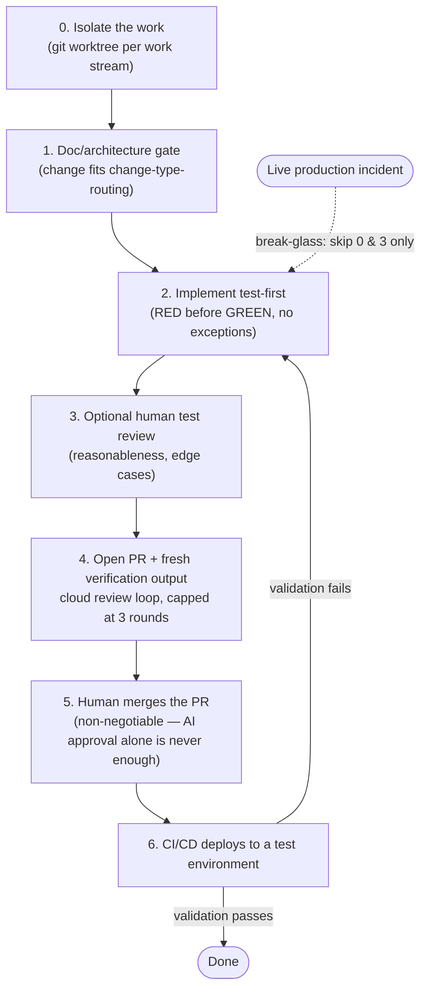
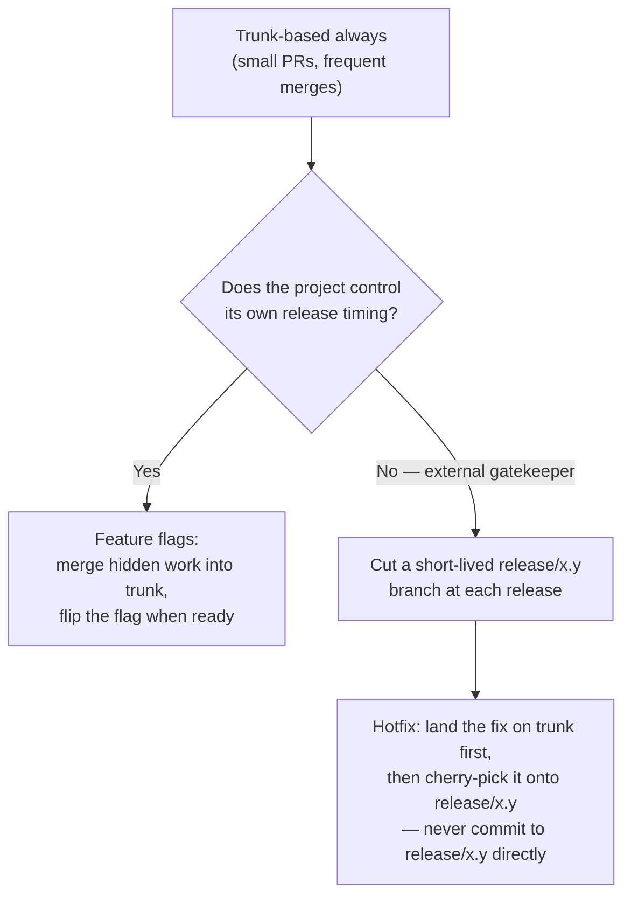

# ai-workflow

*[Traditional Chinese translation available: `README.zh-TW.md`]*

This team's shared execution-stage engineering discipline for Claude Code + superpowers — synced automatically into every collaborator's global Claude Code config, not just a skeleton you copy into individual projects.

## What problem this repo solves

The personal `~/.claude/CLAUDE.md` (per-developer, per-machine) can hold a **decision-stage** rule — how a given developer wants to handle a new requirement, new feature, or behavior change before touching code. What that rule actually says, and which skills or process it leans on, varies per person; this repo has no business assuming every collaborator has the same ones installed. That rule solves "should we do this, and how" — but it's personal, not something a team can share as-is without overwriting everyone's individual preferences.

What's missing is a **team-wide execution stage**: once a decision is made and someone (human or AI) is actually about to touch a repo, which superpowers skill a given change should use (TDD? systematic-debugging? frontend-design?), which specialized agent to call, how deep review should go, and who's allowed to merge — this needs to be the *same* across every collaborator and every project they touch, or the whole point of having a shared standard is lost.

`skills/change-type-routing/` and `skills/team-review-pipeline/` are the two skills that encode this. `skills/change-type-routing/` is a method — not a pre-filled table — for helping a project inventory which mechanism (skill/agent/check) handles which kind of change. `skills/team-review-pipeline/` covers a different axis of the same execution stage: not *which* mechanism handles a change, but *how deep review goes* and *who is allowed to merge* on a team where AI leads most implementation. It composes existing superpowers skills rather than inventing new ones: superpowers:test-driven-development and superpowers:verification-before-completion gate what "tests pass" is allowed to mean; superpowers:using-git-worktrees isolates concurrent work; superpowers:writing-plans / executing-plans break large changes into one-PR-per-task; superpowers:finishing-a-development-branch handles cleanup after merge. Its review-depth exception list, multi-model-review trigger, and 3-round review-loop cap are meant to land as a cross-cutting rule inside a project's own change-type-routing table.

**Where this stands today** — the review-depth exception list covers authN/authZ, payments, data migrations, secrets/infra config, unpinned new dependencies, and (self-referentially) changes to a project's own skill files or `CLAUDE.md`; a break-glass path exists for production incidents but can never skip the exception-list review or the human merge gate, only the isolation and optional-test-review steps. `skills/team-review-pipeline/pressure-scenarios.md` has 7 scenarios, all run once against a fresh subagent and passed.

## Team review pipeline at a glance

`skills/team-review-pipeline/SKILL.md` is the source of truth if this summary drifts — this section exists for a quick, presentation-friendly overview of its flow and rules.

### Dev flow



Break-glass never skips the exception-list code review or the step 5 human merge gate — only isolation and the optional test review, and only for a live incident, with a postmortem PR required within a fixed window afterward.

### Step-by-step core content

| Step | What it requires |
|---|---|
| 0. Isolate | A separate workspace (worktree) per work stream, so concurrent people/agents don't collide on uncommitted state |
| 1. Doc/architecture gate | The change must fit the project's `change-type-routing` rules before any code is written |
| 2. Test-first implementation | A failing test is written and observed RED before implementation; "tests pass" only counts after an actual in-session verification run |
| 3. Optional human test review | Human checks test reasonableness/completeness/edge cases — a per-project choice to skip, unlike the exception-list review below |
| 4. Open PR | Fresh verification output attached; automated cloud review loop runs, capped at 3 rounds before escalating to a human |
| 5. Human merges | The pipeline's one non-negotiable rule — no amount of AI review approval substitutes for it |
| 6. CI/CD deploy & validate | Deploys to a test environment; a failed validation routes back to step 2, never a dead end |

### Review depth: default vs. exception list

Default: review tests only, not implementation — and only holds if the tests were written test-first (a retrofitted test is treated as no review at all). Full code review, plus a second independent model via MCP, is mandatory regardless of test confidence for:

- Authentication / authorization
- Payments or anything touching money
- Data migrations
- Secrets, credentials, or infrastructure config
- Changes to the project's own skill files, `CLAUDE.md`, or `AGENTS.md`
- Any new or updated dependency not already pinned in a lockfile

### Release branching model



Every release needs a traceable marker (a git tag, a version file, a CHANGELOG entry — the project's choice), so a release branch's origin commit and every patch cut onto it afterward stays traceable.

### Three-layer CLAUDE.md split

- **Home layer** (org-wide): synced automatically via this repo's own `SessionStart` hook mechanism (see below).
- **Repo layer** (project-wide): a project's `change-type-routing` table — must include the review-depth exception list, the multi-model-review trigger, the review-loop cap, and the project's chosen release branching model as cross-cutting rows.
- **Folder/package layer** (scoped, optional): a stricter edit boundary for one sensitive subtree (e.g. billing, auth) — supplements, never replaces, the exception list above.

## How the sync works

Every collaborator runs this once:

```
bash scripts/install.sh
```

That one-time step: backs up `~/.claude/settings.json`, points its `SessionStart` hook at `scripts/sync.sh`, and adds a single `@<this-repo-path>/CLAUDE.md` line to the collaborator's personal `~/.claude/CLAUDE.md` (nothing else in that file is touched). From then on, **every session start** re-runs `scripts/sync.sh`, which:

1. Pulls this repo.
2. Symlinks each `skills/*` and `agents/*` subdirectory into the collaborator's global `~/.claude/skills/` and `~/.claude/agents/` — skipping (and warning about, never overwriting) anything already at that path that isn't already this repo's own symlink.
3. Reconciles third-party plugins against `scripts/third-party-plugins.json` (see below) — installs anything missing, warns on version drift, never force-changes an installed version.

This makes already-onboarded collaborators self-healing: add a skill to this repo, and everyone picks it up on their next session, no manual re-sync. The one thing this can't solve is a brand-new collaborator's very first install — nothing enforces that `scripts/install.sh` gets run, since nothing runs until it has; that's a one-time onboarding step, documented, not a mechanism.

**What stays per-project, not global:** the *output* of `change-type-routing` — the actual routing table for a specific project's directory structure — still belongs in that project's own `CLAUDE.md`, since that content is inherently project-specific. Only the skill (the method for producing that table) is global.

**Trust model, stated plainly:** `scripts/sync.sh` and `scripts/install.sh` are executable code that runs unattended on every collaborator's machine, self-updating via `git pull`. Whoever can merge a change to `scripts/` can run arbitrary code on every collaborator's machine on their next session. This repo's own `CLAUDE.md` puts changes to `scripts/*` at a higher scrutiny tier than skill content for exactly this reason — see its cross-cutting rules.

## Keeping third-party plugins consistent

`scripts/third-party-plugins.json` pins the exact version of each team-authored-elsewhere plugin (superpowers, mattpocock-skills, etc.) this team has agreed on. `scripts/sync.sh` checks every session: missing entirely → auto-installs; installed but the wrong version → warns (in both directions, behind or ahead of the pin) rather than forcing a change, since the `claude plugin` CLI has no exact-version-install/downgrade command to force it. Bumping the pinned version is a deliberate, reviewed edit to that file, not a routine update — see `CLAUDE.md`'s table for the review bar on it.

## For projects or people outside this team

If you're not on this team's synced setup — evaluating this repo standalone, or adapting it for a different team — the underlying skills still work copied manually: copy `skills/change-type-routing/SKILL.md` (and its `pressure-scenarios.md`) into a project's `.claude/skills/change-type-routing/`, invoke it there, and follow its inventory steps to produce that project's own routing table (see `examples/spelldungeon.md` for a worked example). Files copied this way don't stay synced with this repo automatically; that's expected to diverge into a project's own concrete version.

## This repo's own conventions

This repo dogfoods its own method: `CLAUDE.md` at the root is this repo's *own* change-type-routing table (skill content, agent definitions, pressure-scenario files, worked examples, sync/install scripts, top-level docs), plus cross-cutting rules that put governance-file and sync-script changes at the highest scrutiny here — the latter above the former, since scripts execute unattended while prose only gets read. Summary below — `CLAUDE.md` is authoritative if this drifts.

**Change types and what merging one requires:**

| Change type | Files | What's required |
|---|---|---|
| Skill content | `skills/*/SKILL.md` | Frontmatter `description` stays "Use when..." trigger-only — never a summary of the skill's workflow. Any content change must be re-validated against that skill's own `pressure-scenarios.md` before merge, with transcript evidence kept. |
| Agent definitions | `agents/*` | Same bar as skill content — read fully before merge, since these become every collaborator's callable subagent types once synced. |
| Pressure-scenario files | `skills/*/pressure-scenarios.md` | Adding or editing a scenario needs at least one actual subagent run with pass/fail evidence attached to the PR — a written-but-never-run scenario is a draft, not validated. |
| Worked examples | `examples/*.md` | Must reflect a real applied case. If no real project has applied the method yet, say so explicitly rather than presenting a plausible-looking fabrication. |
| Sync/install scripts | `scripts/*.sh`, `scripts/*.py` | This repo's highest-scrutiny category — see cross-cutting rules below. |
| Third-party plugin pin | `scripts/third-party-plugins.json` | A version bump is a deliberate, reviewed decision (what changed upstream, why it's safe to move to) — not a routine dependency-bot update. |
| Top-level docs | `README.md`, `README.zh-TW.md` | Update whenever a skill, agent, or script is added, renamed, or removed, and keep the skill list and cross-references accurate. `README.zh-TW.md` may lag briefly but shouldn't drift permanently; `README.md` is authoritative on conflict. |

**Cross-cutting rules, priority over every row above:**

1. Any change touching a `SKILL.md` or the root `CLAUDE.md` is highest scrutiny full-stop — these become other projects' or every collaborator's governance rules once synced or copied out, and a subtle wording bug (an ambiguous instruction, a dropped exception) propagates silently with no test suite to catch it. Never skip a full diff read because "it's just wording."
2. Any change to `scripts/*.sh` or `scripts/*.py` is scrutinized *above even that*. A bad SKILL.md edit misleads an AI reading text; a bad script edit *executes*, unattended, with every collaborator's local permissions on every session start. This trade (self-updating via `git pull`, instead of everyone manually re-running `scripts/install.sh` per logic change) only holds if this category actually gets read line-by-line before merge, every time, by someone other than the author.

**PR granularity:** one skill, one agent, or one fix per PR. This repo's whole purpose is to be diffed and its pieces synced or copied independently, so a PR mixing unrelated changes makes both review and later reverts harder.

**Language:** skill, agent, and doc content (including script comments) is written in English; `README.zh-TW.md` is the one deliberate translation exception and shouldn't drift permanently behind `README.md`. This is independent of whatever language a session uses to talk about the repo.
