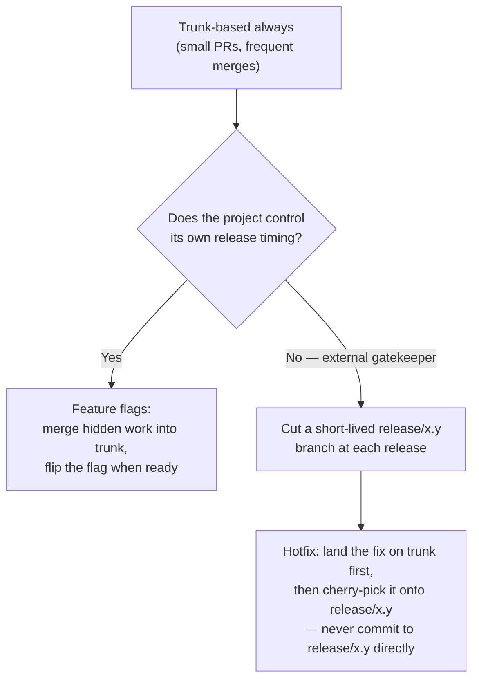

# ai-workflow

*[Traditional Chinese translation available: `README.zh-TW.md`]*

This team's shared execution-stage engineering discipline for Claude Code + superpowers — synced automatically into every collaborator's global Claude Code config, not just a skeleton you copy into individual projects.

## What problem this repo solves

The personal `~/.claude/CLAUDE.md` (per-developer, per-machine) can hold a **decision-stage** rule — how a given developer wants to handle a new requirement, new feature, or behavior change before touching code. What that rule actually says, and which skills or process it leans on, varies per person; this repo has no business assuming every collaborator has the same ones installed. That rule solves "should we do this, and how" — but it's personal, not something a team can share as-is without overwriting everyone's individual preferences.

What's missing is a **team-wide execution stage**: once a decision is made and someone (human or AI) is actually about to touch a repo, which superpowers skill a given change should use (TDD? systematic-debugging? frontend-design?), which specialized agent to call, how deep review should go, and who's allowed to merge — this needs to be the *same* across every collaborator and every project they touch, or the whole point of having a shared standard is lost.

`skills/change-type-routing/` and `skills/team-review-pipeline/` are the two skills that encode this. `skills/change-type-routing/` is a method — not a pre-filled table — for helping a project inventory which mechanism (skill/agent/check) handles which kind of change. `skills/team-review-pipeline/` covers a different axis of the same execution stage: not *which* mechanism handles a change, but *how deep review goes* and *who is allowed to merge* on a team where AI leads most implementation. It composes existing superpowers skills rather than inventing new ones: superpowers:test-driven-development and superpowers:verification-before-completion gate what "tests pass" is allowed to mean; superpowers:using-git-worktrees isolates concurrent work; superpowers:writing-plans / executing-plans break large changes into one-PR-per-task; superpowers:finishing-a-development-branch handles cleanup after merge. Its review-depth exception list, multi-model-review trigger, and 3-round review-loop cap are meant to land as a cross-cutting rule inside a project's own change-type-routing table.

**Where this stands today** — review depth is measured as reviewer independence rather than as how much a human reads, and the exception list names the categories that cannot be cleared by the cheapest reviewer available. A break-glass path exists for production incidents; it skips isolation and nothing else. `skills/team-review-pipeline/pressure-scenarios.md` has 8 scenarios, each run against a fresh subagent.

## Team review pipeline at a glance

`skills/team-review-pipeline/SKILL.md` is the source of truth if this summary drifts — this section exists for a quick, presentation-friendly overview of its flow and rules.

### Dev flow


Break-glass skips isolation and nothing else. It never skips the local review, the exception list's level-2 requirement, or the step 5 human merge gate — and it applies only to a live incident, with a postmortem PR required within a fixed window afterward.

### Step-by-step core content

| Step | What it requires |
|---|---|
| 0. Isolate | A separate workspace (worktree) per work stream, so concurrent people/agents don't collide on uncommitted state |
| 1. Doc/architecture gate | The change must fit the project's `change-type-routing` rules before any code is written |
| 2. Test-first implementation | A failing test is written and observed RED before implementation; "tests pass" only counts after an actual in-session verification run |
| 3. Local review | A reviewer at the project's declared independence level reads the full diff, before a PR exists. Not optional, and not a human step |
| 4. Open PR | Fresh verification output attached; cloud review loop runs, capped at 3 rounds, then the human decides disposition — kill, re-scope, or override with a recorded reason |
| 5. Human merges | The pipeline's one non-negotiable rule — no amount of AI review approval substitutes for it. The decision is scope, not correctness, and it requires cloud review to have passed |
| 6. CI/CD deploy & validate | Deploys to a test environment; a failed validation routes back to step 2, never a dead end |

### Review depth: independence, not how much a human reads

**A human does not read a diff unless there is a specific reason to** — overriding a review verdict, or a category the project has explicitly declared in its routing table. "This one feels risky" is named in the skill as exactly the kind of non-reason the rule exists to exclude, because it is the condition under which someone skims 200 lines, sees nothing, and reports that they read it.

Depth is measured as **how uncorrelated the reviewing judgment is from the authoring one**. The ladder, strongest first:

| Level | Reviewer |
|---|---|
| 1 | A different human |
| 2 | A different model |
| 3 | The same model, fresh session, no context |
| 4 | The same model, same session — not a review at all |

Every change gets two layers: a **local review** before the PR exists, and **cloud review** on it. The exception list below requires the local review to be at **level 2 or better** and may never skip cloud review:

- Authentication / authorization
- Payments or anything touching money
- Data migrations
- Secrets, credentials, or infrastructure config
- Changes to the project's own skill files, `CLAUDE.md`, `CONTEXT.md`, or `AGENTS.md`
- Any new or updated dependency not already pinned in a lockfile

Note what that list no longer means: it does not summon a human to read the code. That was its meaning when depth was measured in human attention, and it never survived contact with a deadline.

### Release branching model



Every release needs a traceable marker (a git tag, a version file, a CHANGELOG entry — the project's choice), so a release branch's origin commit and every patch cut onto it afterward stays traceable.

### Three-layer CLAUDE.md split

- **Home layer** (org-wide): synced automatically via this repo's own `SessionStart` hook mechanism (see below).
- **Repo layer** (project-wide): a project's `change-type-routing` table — must include the review-depth exception list, the multi-model-review trigger, the review-loop cap, and the project's chosen release branching model as cross-cutting rows.
- **Folder/package layer** (scoped, optional): a stricter edit boundary for one sensitive subtree (e.g. billing, auth) — supplements, never replaces, the exception list above.

## How the sync works

Every collaborator runs this once:

```
bash scripts/install.sh
```

That one-time step: backs up `~/.claude/settings.json`, points its `SessionStart` hook at `scripts/sync.sh`, and adds a single `@<this-repo-path>/CLAUDE.md` line to the collaborator's personal `~/.claude/CLAUDE.md` (nothing else in that file is touched). From then on, **every session start** re-runs `scripts/sync.sh`, which:

1. Pulls this repo.
2. Symlinks each `skills/*` and `agents/*` subdirectory into the collaborator's global `~/.claude/skills/` and `~/.claude/agents/` — skipping (and warning about, never overwriting) anything already at that path that isn't already this repo's own symlink. It also removes the reverse: a link this repo created for a skill or agent that no longer exists here is deleted and reported, so renaming or deleting one propagates instead of leaving a dangling link on every machine. That prune is deliberately narrow — only a symlink pointing into this repo whose target is gone; a real directory, another tool's link, or a live link is never touched.
3. Reconciles third-party plugins against `scripts/third-party-plugins.json` (see below) — installs anything missing, reports drift from a recorded version, never force-changes an installed version.

This makes already-onboarded collaborators self-healing: add a skill to this repo, and everyone picks it up on their next session, no manual re-sync. The one thing this can't solve is a brand-new collaborator's very first install — nothing enforces that `scripts/install.sh` gets run, since nothing runs until it has; that's a one-time onboarding step, documented, not a mechanism.

**What stays per-project, not global:** the *output* of `change-type-routing` — the actual routing table for a specific project's directory structure — still belongs in that project's own `CLAUDE.md`, since that content is inherently project-specific. Only the skill (the method for producing that table) is global.

**Trust model, stated plainly:** `scripts/sync.sh` and `scripts/install.sh` are executable code that runs unattended on every collaborator's machine, self-updating via `git pull`. Whoever can merge a change to `scripts/` can run arbitrary code on every collaborator's machine on their next session. This repo's own `CLAUDE.md` puts changes to `scripts/*` at a higher scrutiny tier than skill content for exactly this reason — see its cross-cutting rules.

## Keeping third-party plugins consistent

`scripts/third-party-plugins.json` lists the third-party plugins (superpowers, mattpocock-skills, etc.) this team expects on every machine. `scripts/sync.sh` checks every session: missing entirely → auto-installs; installed at a different version than the one recorded → warns (in both directions, behind or ahead) rather than forcing a change.

**Version tracking here is advisory, not a real pin, and the manifest says so.** `claude plugin install` has no flag to request a specific version, so a missing plugin is always installed at whatever the marketplace currently serves — the recorded version can be reported against, never enforced. It is also **semver-only**: an entry that omits `version` is deliberately untracked, which is the right setting for a plugin the marketplace versions by its own repo commit sha (that sha changes on every upstream commit, so comparing it would warn on every session forever, and a warning that always fires is a warning nobody reads). A non-semver value left in a `version` field is reported as a manifest error, not compared.

Adding a plugin or changing a recorded version is a deliberate, reviewed edit to that file, not a routine update — see `CLAUDE.md`'s table for the review bar on it.

## For projects or people outside this team

If you're not on this team's synced setup — evaluating this repo standalone, or adapting it for a different team — the underlying skills still work copied manually: copy `skills/change-type-routing/SKILL.md` (and its `pressure-scenarios.md`) into a project's `.claude/skills/change-type-routing/`, invoke it there, and follow its inventory steps to produce that project's own routing table (see `examples/spelldungeon.md` for a worked example). Files copied this way don't stay synced with this repo automatically; that's expected to diverge into a project's own concrete version.

## This repo's own conventions

`CONTEXT.md` at the root is this repo's glossary — the terms its rules are written in (`Author`, `Reviewer independence`, `Merge gate`, `Local review`, `Cloud review`). It is a glossary and nothing else: no rules, no rationale, no implementation detail. When a rule below or in `CLAUDE.md` uses one of those terms, that file is where the term is pinned down.

This repo dogfoods its own method: `CLAUDE.md` at the root is this repo's *own* change-type-routing table — one row per change type (skill content, agent definitions, pressure-scenario files, worked examples, sync/install scripts, plugin pin, glossary, top-level docs), each stating what a PR in that category must attach, plus cross-cutting rules covering how review works here and who merges.

**That table is deliberately not reproduced here.** It used to be, in both READMEs, and keeping three copies of one table in sync cost more than it was ever worth — a single rewrite of it produced a merge conflict across two languages the first time it was touched. Read `CLAUDE.md`; it is short, and it is the only copy.

Two things from it are worth stating in the README, because they are what a reader evaluating this repo actually wants to know:

- **The mechanical checks run in CI**, on every PR and every push to `main`: `shellcheck` over the shell scripts, a Python syntax check and a JSON validity check over the rest, and `scripts/check_repo.py`, which catches what goes stale silently in a prose repo — a skill added without a README mention, a frontmatter `description` that drifts back into summarising the workflow, a skill with no `pressure-scenarios.md` to validate it against. It is safe to run by hand at any time. There is no branch protection here, so CI reports rather than blocks.
- **Two categories must attach evidence to the PR.** A change to a skill file attaches the run of that skill's `pressure-scenarios.md`; a change to a script that runs on collaborators' machines attaches the command and output of running it in a throwaway environment. Neither ranks above the other — they fail in different units, so each states its own requirement rather than sitting on a severity ladder.

**PR granularity:** one skill, one agent, or one fix per PR. This repo's whole purpose is to be diffed and its pieces synced or copied independently, so a PR mixing unrelated changes makes both review and later reverts harder.

**Language:** skill, agent, and doc content (including script comments) is written in English; `README.zh-TW.md` is the one deliberate translation exception and shouldn't drift permanently behind `README.md`. This is independent of whatever language a session uses to talk about the repo.
