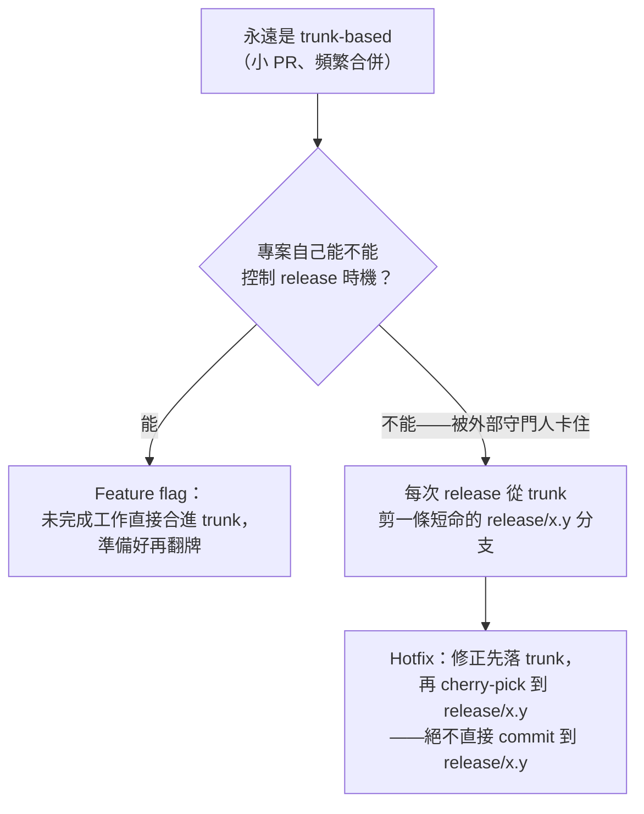

> 正體中文翻譯版，內容以 [`README.md`](./README.md)（英文，本專案 `CLAUDE.md` 訂定的標準版本）為準；兩份不同步時，以英文版為主。

# ai-workflow

這個團隊共用的執行階段工程紀律，給 Claude Code + superpowers 用——會自動同步進每個協作者的全域 Claude Code 配置，不只是一份要你手動複製進各個專案的骨架。

## 這個 repo 在解決什麼問題

個人的 `~/.claude/CLAUDE.md`（每個開發者、每台機器各一份）可以放一條**決策階段**規則——某個開發者遇到新需求、新功能、行為變更時，動手改代碼之前想怎麼處理。這條規則實際內容是什麼、靠哪些 skill 或流程,因人而異;這個 repo 沒有立場預設每個協作者都裝了同一套。那條規則解決的是「要不要做、怎麼做」——但它是個人的，沒辦法原封不動變成團隊共用規則，不然會蓋掉每個人各自的偏好。

真正缺的是**團隊層級的執行階段**：決定做了、真的要動手（不管是人還是 AI）改 repo 時，一個改動該套哪個 superpowers skill（TDD？systematic-debugging？frontend-design？）、該叫哪個專職 agent、審查要多深、誰有權合併——這件事需要對每個協作者、每個專案都**一致**，不然「團隊共用標準」這件事本身就沒意義。

`skills/change-type-routing/` 和 `skills/team-review-pipeline/` 這兩個 skill 就是把這件事寫成方法。`skills/change-type-routing/` 是一套方法——不是抄好的表——用來幫專案盤點出「哪種改動該用哪個機制（skill/agent/check）」。`skills/team-review-pipeline/` 管的是同一個執行階段的另一個軸：不是「哪個機制處理這個改動」，而是在 AI 主導大部分實作的團隊裡，「審查要多深、誰有權合併」。它組合既有的 superpowers skill，不另外發明機制：superpowers:test-driven-development 和 superpowers:verification-before-completion 決定「測試通過」算不算數；superpowers:using-git-worktrees 隔離併發中的工作；superpowers:writing-plans／executing-plans 把大改動拆成一個 task 一個 PR；superpowers:finishing-a-development-branch 負責合併後的清理。它的 review-depth 例外清單、多模型審查觸發條件、3 輪 review-loop 上限，都應該落地成專案自己 change-type-routing 表裡的橫切規則。

**目前進度**——審查深度的衡量標準是審查者的獨立性，而不是人類讀了多少；例外清單列的是「不能用最便宜的審查者結案」的那些類別。針對正式環境事故有一條 break-glass 路徑，它只跳過隔離，其他什麼都不跳。`skills/team-review-pipeline/pressure-scenarios.md` 現在有 8 個情境，每個都拿 fresh subagent 實際跑過。

## Team review pipeline 一覽

`skills/team-review-pipeline/SKILL.md` 才是原始依據，這份摘要跟它有出入時以它為準——這一節純粹是為了方便快速掌握流程跟規則、適合直接拿去做簡報。

### 開發流程


Break-glass 永遠不能跳過例外清單審查或第 5 步的人類合併閘——只能跳過隔離跟可選的測試審查，而且只限真的在發生事故時，事後還要在固定時限內補一份 postmortem PR。

### 各步驟核心內容

| 步驟 | 要求什麼 |
|---|---|
| 0. 隔離 | 每條工作線各自獨立的工作區（worktree），避免併發的人或 agent 在未提交狀態上互撞 |
| 1. 文件／架構閘門 | 動手寫程式碼之前，先確認改動符合專案的 `change-type-routing` 規則 |
| 2. Test-first 實作 | 先寫出一個會失敗（紅）的測試並實際觀察到它失敗，才開始實作；「測試通過」只有在這個 session 裡真的跑過驗證才算數 |
| 3. Local review | 由達到專案宣告獨立性層級的審查者讀完整 diff，發生在 PR 出現之前。不是選配，也不是人類的工作 |
| 4. 開 PR | 附上最新的驗證輸出；跑雲端審查迴圈，上限 3 輪，超過由人類決定去留——砍掉、重新切小，或帶著書面理由推翻審查 |
| 5. 人類合併 | 整條 pipeline 唯一不可商量的規則——再多的 AI 審查核可都不能取代它。決定的是範圍不是對錯，而且必須雲端審查已經通過 |
| 6. CI/CD 部署與驗證 | 部署到測試環境；驗證失敗會導回第 2 步，不會變成沒人管的死路 |

### 審查深度：獨立性，不是人類讀了多少

**如非必要，人類不讀任何 diff。**「必要」只有兩種：要推翻審查結論，或是專案已經在自己的 routing table 裡明文宣告的類別。「這次感覺比較危險」被 skill 明確點名為**不算理由**——因為那正是一個人略讀 200 行、什麼也沒看到、然後回報說他讀過了的那種情境。

深度的衡量標準是**審查判斷與撰寫判斷之間有多不相關**。階梯由強到弱：

| 層級 | 審查者 |
|---|---|
| 1 | 另一個人類 |
| 2 | 另一個模型 |
| 3 | 同一個模型、全新 session、沒有上下文 |
| 4 | 同一個模型、同一個 session——這根本不算審查 |

每個改動都要兩層：PR 出現之前的 **local review**，以及 PR 上的 **cloud review**。以下例外清單要求 local review 必須是 **level 2 或更高**，而且永遠不能跳過 cloud review：

- 認證／授權
- 金流或任何碰錢的東西
- 資料遷移
- 密鑰、憑證、基礎設施設定
- 改動專案自己的 skill 檔案、`CLAUDE.md`、`CONTEXT.md` 或 `AGENTS.md`
- 任何還沒鎖定在 lockfile 裡的新／更新依賴

注意這份清單現在**不再**是什麼意思：它不會召喚一個人類來讀程式碼。那是審查深度還用人類注意力衡量時的意思，而那個版本從來沒有在任何一次 deadline 面前存活下來。

### Release 分支模型



每次 release 都要留下可追溯的標記（git tag、版本檔案、CHANGELOG 條目——形式由專案自訂），讓 release 分支的起始 commit、以及後續每次補丁都能追溯回去。

### CLAUDE.md 三層分法

- **Home 層**（組織／團隊層級）：透過這個 repo 自己的 `SessionStart` hook 機制自動同步（見下方說明）。
- **Repo 層**（專案層級）：專案自己的 `change-type-routing` 表——必須把 review-depth 例外清單、多模型審查觸發條件、review-loop 上限，以及專案選定的 release 分支模型，都寫成橫切規則的列。
- **Folder／package 層**（範圍限定、選用）：針對某個敏感子目錄（例如金流、認證模組）額外收緊的編輯邊界——是對上面例外清單的補充，不是替代。

## 同步機制怎麼運作

每位協作者跑這一次：

```
bash scripts/install.sh
```

這個一次性步驟會：備份 `~/.claude/settings.json`、把它的 `SessionStart` hook 指向 `scripts/sync.sh`、在協作者個人的 `~/.claude/CLAUDE.md` 加一行 `@<這個repo的路徑>/CLAUDE.md`（那份檔案裡其他內容完全不動）。從此之後，**每次 session 啟動**都會重跑 `scripts/sync.sh`，它會：

1. `git pull` 這個 repo。
2. 把 `skills/*`、`agents/*` 底下每個子目錄 symlink 進協作者全域的 `~/.claude/skills/`、`~/.claude/agents/`——如果該路徑已經有東西、而且不是這個 repo 建的 symlink，就跳過並警告，絕不覆蓋。反方向也會處理：這個 repo 建過、但對應的 skill 或 agent 已經不存在的連結會被刪掉並回報，所以改名或刪除才會真的傳播出去，而不是在每台機器上留下一個死連結。這個清理刻意做得很窄——只清「指向這個 repo、而且目標已經消失」的 symlink；真實目錄、別的工具建的連結、還活著的連結，一律不動。
3. 對照 `scripts/third-party-plugins.json`（見下）核對第三方 plugin——缺的就裝，跟記錄的版本對不上就警告，絕不強制改版本。

這讓已經裝好的協作者能自我修復：repo 加了新 skill，大家下次開 session 就會自動拿到，不用手動重新同步。唯一沒辦法解決的，是全新協作者的第一次安裝——沒人能強制他跑 `scripts/install.sh`，因為在他跑之前什麼機制都還沒生效；這是一個文件化的 onboarding 步驟，不是機制。

**還留在專案層級、沒有全域化的部分**：`change-type-routing` 產出的**那張表**——某個專案針對自己目錄結構產出的實際路由表——還是留在那個專案自己的 `CLAUDE.md` 裡，因為那份內容本來就是專案專屬的。全域化的只有「產出那張表的方法（skill 本身）」。

**信任模型，講清楚**：`scripts/sync.sh`、`scripts/install.sh` 是會在每個協作者機器上無人看管自動執行的程式碼，而且透過 `git pull` 自我更新。誰能合併 `scripts/` 的改動，誰就能在每個協作者的機器上、下次 session 執行任意程式碼。這正是為什麼這個 repo 自己的 `CLAUDE.md` 把 `scripts/*` 的變更風險列得比一般 skill 內容更高——見它的橫切規則。

## 保持第三方 plugin 版本一致

`scripts/third-party-plugins.json` 列出這個團隊要求每台機器都要有的第三方 plugin（superpowers、mattpocock-skills 等）。`scripts/sync.sh` 每次 session 都會檢查：完全沒裝就自動裝；裝了但版本跟記錄的不一樣就警告（落後或超前都會報），不強制改版本。

**這裡的版本追蹤是「參考記錄」，不是真的釘選，而且 manifest 裡就是這樣寫的。** `claude plugin install` 沒有指定版本的參數，所以缺的 plugin 一定是裝 marketplace 當下提供的版本——記錄下來的版本只能拿來比對回報，無法強制。它同時**只支援 semver**：沒有 `version` 欄位的項目就是刻意不追版本，對於那些由 marketplace repo 自己的 commit sha 當版本號的 plugin 來說這才是正確設定（那個 sha 每次上游 commit 都會變，拿來比對就會每個 session 永遠警告，而一個永遠會響的警告等於沒有警告）。`version` 欄位裡留了非 semver 的值，會被當成 manifest 設定錯誤回報，不會拿去比對。

新增一個 plugin 或改動記錄的版本，是對這份檔案的一次刻意、需要審查的編輯，不是例行更新——審查標準見 `CLAUDE.md` 的分類表。

## 給這個團隊以外的專案或人

如果你不在這個團隊的同步設定裡——單純想評估這個 repo，或想改給別的團隊用——底層的 skill 手動複製一樣能用：把 `skills/change-type-routing/SKILL.md`（連同 `pressure-scenarios.md`）複製進某個專案的 `.claude/skills/change-type-routing/`，在那裡叫這個 skill，跟著它的盤點步驟產出那個專案自己的路由表（參考 `examples/spelldungeon.md` 的實例）。這樣複製出去的檔案不會自動跟這個 repo 同步，本來就預期會分岔成那個專案自己的具體版本。

## 這個 repo 自己的規範

根目錄的 `CONTEXT.md` 是這個 repo 的詞彙表——它的規則所使用的那些詞（`Author`、`Reviewer independence`、`Merge gate`、`Local review`、`Cloud review`）都定義在那裡。它只是詞彙表，不放規則、不放理由、不放實作細節。下面或 `CLAUDE.md` 的規則用到這些詞時，以那份檔案為準。

這個 repo 自己吃自己的狗食：根目錄的 `CLAUDE.md` 就是這個 repo **自己的** change-type-routing 表——每種改動類型一列（skill 內容、agent 定義、pressure-scenario 檔案、worked example、同步／安裝腳本、plugin 釘選、詞彙表、頂層文件），每一列寫明那一類的 PR 必須附上什麼，外加橫切規則說明這裡的審查怎麼跑、誰負責合併。

**那張表刻意不在這裡重抄一遍。** 以前兩份 README 都各抄了一份，維護三份同一張表的成本遠超過它的價值——它第一次被改寫時就立刻在兩個語言之間製造了一個合併衝突。請直接讀 `CLAUDE.md`，它很短，而且是唯一的一份。

其中兩件事值得寫在 README，因為那是評估這個 repo 的人真正想知道的：

- **機械檢查跑在 CI 上**，每個 PR 與每次推上 `main` 都會跑：`shellcheck` 掃 shell 腳本、Python 語法與 JSON 合法性檢查，以及 `scripts/check_repo.py`——它抓的是純文件 repo 裡會無聲腐爛的那些東西：新增了 skill 卻沒寫進 README、frontmatter 的 `description` 又滑回去總結工作流程、某個 skill 沒有 `pressure-scenarios.md` 可以驗證。它隨時可以手動跑。這個 repo 沒有 branch protection，所以 CI 是回報，不是閘門。
- **有兩類改動必須在 PR 附上證據。** 改 skill 檔案要附那個 skill 的 `pressure-scenarios.md` 執行結果；改動會在協作者機器上執行的腳本，要附在用完即丟的環境裡跑過的指令與輸出。兩者不分高下——它們的失效不同單位，所以各自寫自己的要求，而不是排在同一條嚴重性階梯上。

**PR 粒度**：一個 skill、一個 agent 或一個修正一個 PR。這個 repo 存在的意義就是被 diff、被獨立同步或複製，所以混了不相關改動的 PR 會讓審查和日後的還原都更難。

**語言：** skill、agent、文件內容（包含腳本註解）都用英文寫；`README.zh-TW.md` 是唯一刻意保留的翻譯例外，不該永久落後 `README.md` 太多。這跟 session 本身用什麼語言討論這個 repo 無關。
