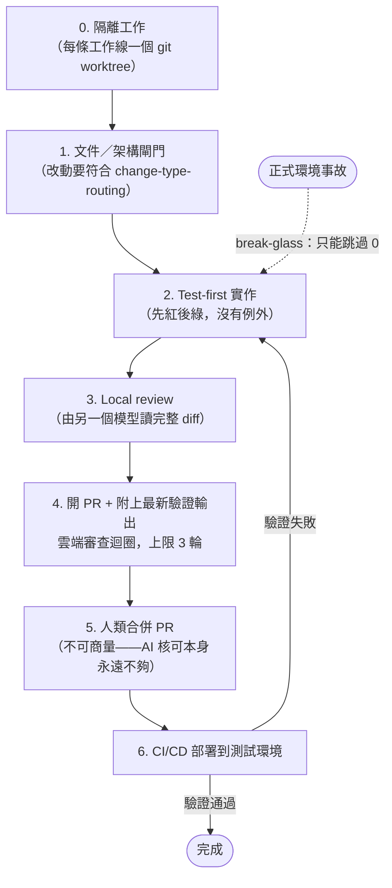

> 正體中文翻譯版，內容以 [`README.md`](./README.md)（英文，本專案 `CLAUDE.md` 訂定的標準版本）為準；兩份不同步時，以英文版為主。

# ai-workflow

這個團隊共用的執行階段工程紀律，給 Claude Code + superpowers 用——會自動同步進每個協作者的全域 Claude Code 配置，不只是一份要你手動複製進各個專案的骨架。

## superpowers 沒管到什麼

superpowers 已經管掉大部分執行階段的事。這個 repo 存在的理由只有一個：補上它對單一 session 有效、但對一個**團隊**還缺的那塊：

| 團隊需要什麼 | superpowers | 這個 repo |
|---|---|---|
| Reviewer independence——寫程式碼的模型審自己的程式碼，不算審查 | 一半有。`subagent-driven-development` 禁止用 implementer 的自我審查取代審查，也不准它自己派審查者，而且規定每次派工都要明講模型是哪個——但沒有規定審查的模型一定要跟寫程式碼的不一樣，`requesting-code-review` 預設派的是 `general-purpose` subagent（那是 agent 類型，不是模型），從沒指名模型是誰 | 獨立性階梯，而且達到哪個層級要從執行紀錄裡驗證，不是照著請求內容假設 |
| 每個人用同一套規則、同一版 plugin | 沒有。superpowers 是每人每台機器各自裝的 | `scripts/sync.sh` 跟 `scripts/install.sh`：一個 `SessionStart` hook，拉這個 repo、把它的 skill 連進每個協作者的全域配置 |
| 有些改動需要比別的改動更嚴格的審查 | 一半有。`subagent-driven-development` 會依「diff 的大小、複雜度、風險」調整審查者——但沒有指名類別，審查者底線（一般是 mid-tier，最終的全分支審查則要求最強模型）是為了成本，不是跟改動碰到什麼綁在一起的關卡 | 例外清單：認證、金流、資料遷移、密鑰、治理檔案、沒鎖版的依賴，六項共用同一條底線（level 2 或更高） |
| 誰有權放行一個改動 | 一半有。`finishing-a-development-branch` 說整合的決定是人類的，但同時提供一個 AI 自己執行的本地合併選項，也從沒說過 AI 核可本身不夠 | 每次合併都由人類執行，而且合併前必須雲端審查已經通過 |
| 什麼時候該停止跟審查者爭 | 一半有。上游把 session 內的修正迴圈上限訂在 5 輪，並且針對對錯做出裁決 | 這個 repo 把 PR／雲端審查迴圈上限訂在 3 輪，把升級定義成範圍決定，不是對錯判斷 |

superpowers 涵蓋的其他東西——TDD、verification-before-completion、worktree 隔離、拆解計畫、審查的請求與接收機制——這個 repo 原封不動沿用，不重新實作。這個 repo 真的改動某個上游 skill 行為、而不只是補一個缺口的地方，那個 override 會明確指名、寫清楚差異在哪，放在 `CLAUDE.md` 的 **Relationship to superpowers** 這一節——這裡不重複。

**目前進度：** 還沒有任何商業團隊真的用過這套。它正在一個真實專案上驗證（紀錄在 `examples/`），驗證完才會考慮推廣。

## 這個 repo 在解決什麼問題

個人的 `~/.claude/CLAUDE.md` 可以放一條**決策階段**規則——某個開發者遇到新需求，動手改代碼之前想怎麼處理。這是個人的事，不在這裡的範圍內。

真正缺的是**團隊層級的執行階段**：決定做了、真的要動手（不管是人還是 AI）改 repo 時，該套哪個 superpowers skill、審查要多深、誰有權合併——這件事需要對每個協作者、每個專案都**一致**。

`skills/change-type-routing/` 和 `skills/team-review-pipeline/` 把這件事寫成方法。`change-type-routing` 是一套方法——不是抄好的表——用來盤點「哪種改動該用哪個機制」。`team-review-pipeline` 管的是另一個軸：在 AI 主導大部分實作的團隊裡，審查要多深、誰有權合併。它的 review-depth 例外清單、多模型審查觸發條件、3 輪 review-loop 上限，都應該落地成專案自己 `change-type-routing` 表裡的橫切規則。

審查深度的衡量標準是**審查者的獨立性**，而不是人類讀了多少：另一個人類、另一個模型、同一個模型全新 session 沒有上下文、或同一個 session——由強到弱。Break-glass 只跳過一次事故當下的隔離，其他什麼都不跳——絕不跳過 local review、例外清單，或人類合併閘。完整的模型（包含已發布版本的 hotfix 怎麼回到 trunk）見 `skills/team-review-pipeline/SKILL.md`。它的 `pressure-scenarios.md` 有 10 個情境，目前已經實際跑過的都留有紀錄。

## 開發流程



每一步的要求和例外清單，以 `skills/team-review-pipeline/SKILL.md` 為準；這裡只是一張流程圖，不能取代讀它。

## 同步機制怎麼運作

每位協作者跑這一次：

```
bash scripts/install.sh
```

這個一次性步驟會：備份 `~/.claude/settings.json`、把它的 `SessionStart` hook 指向 `scripts/sync.sh`、在協作者個人的 `~/.claude/CLAUDE.md` 加一行 `@<這個repo的路徑>/CLAUDE.md`（那份檔案裡其他內容完全不動）。從此之後，**每次 session 啟動**都會重跑 `scripts/sync.sh`，它會：

1. `git pull` 這個 repo。
2. 把 `skills/*`、`agents/*` 底下每個子目錄 symlink 進協作者全域的 `~/.claude/skills/`、`~/.claude/agents/`——如果該路徑已經有東西、而且不是這個 repo 建的 symlink，就跳過並警告，絕不覆蓋。反方向也會處理：這個 repo 建過、但對應的 skill 或 agent 已經不存在的連結會被刪掉並回報，所以改名或刪除才會真的傳播出去。目前還沒有 `agents/` 這個目錄——腳本的 `sync_dir` 遇到來源目錄不存在就直接返回，所以什麼都不會連、也不會警告。
3. 對照 `scripts/third-party-plugins.json`（見下）核對第三方 plugin——缺的就裝，跟記錄的版本對不上就警告，絕不強制改版本。

這讓已經裝好的協作者能自我修復：repo 加了新 skill，大家下次開 session 就會自動拿到，不用手動重新同步。唯一沒辦法解決的是全新協作者的**第一次**安裝——在他跑 `scripts/install.sh` 之前什麼機制都還沒生效；這是一個文件化的一次性 onboarding 步驟，不是機制。

**留在專案層級的部分：** `change-type-routing` 產出的實際路由表，屬於那個專案自己的 `CLAUDE.md`；全域化的只有產出那張表的方法本身。

**信任模型，講清楚：** `scripts/sync.sh`、`scripts/install.sh` 會在每個協作者機器上無人看管自動執行，而且透過 `git pull` 自我更新。誰能合併 `scripts/` 的改動，誰就能在下次 session 在每個協作者機器上跑任意程式碼——這正是為什麼 `CLAUDE.md` 把 `scripts/*` 的審查門檻訂得比一般 skill 內容更高。

## 保持第三方 plugin 版本一致

`scripts/third-party-plugins.json` 列出這個團隊要求每台機器都要有的第三方 plugin（superpowers、mattpocock-skills 等）。`scripts/sync.sh` 每次 session 都會檢查：沒裝就自動裝；裝了但版本跟記錄的不一樣就警告（不分落後或超前），不強制改版本。

**這裡的版本追蹤是參考記錄，不是真的釘選。** `claude plugin install` 沒有指定版本的參數，所以缺的 plugin 一定是裝 marketplace 當下提供的版本——記錄下來的版本只能拿來比對回報，無法強制。它也只支援 semver：對於那些由 marketplace 自己的 commit sha 當版本號的 plugin（每次上游 commit 就會變），刻意不追蹤，因為拿來比對只會每個 session 永遠警告。

新增一個 plugin 或改動記錄的版本，是一次刻意、需要審查的編輯——審查標準見 `CLAUDE.md` 的分類表。

## 給這個團隊以外的專案或人

如果你不在這個團隊的同步設定裡——單純想評估這個 repo，或想改給別的團隊用——底層的 skill 手動複製一樣能用：把 `skills/change-type-routing/SKILL.md`（連同 `pressure-scenarios.md`）複製進某個專案的 `.claude/skills/change-type-routing/`，在那裡叫這個 skill，跟著它的盤點步驟產出那個專案自己的路由表（參考 `examples/spelldungeon.md` 的實例）。這樣複製出去的檔案不會自動跟這個 repo 同步，本來就預期會分岔成那個專案自己的具體版本。

## 這個 repo 自己的規範

根目錄的 `CONTEXT.md` 是這個 repo 的詞彙表——它的規則所使用的那些詞（`Author`、`Reviewer independence`、`Merge gate`、`Local review`、`Cloud review`）都定義在那裡。它只是詞彙表，不放規則、不放理由、不放實作細節。

這個 repo 自己吃自己的狗食：根目錄的 `CLAUDE.md` 就是這個 repo **自己的** change-type-routing 表——每種改動類型一列（skill 內容、agent 定義、pressure-scenario 檔案、worked example、design specs and plans、同步／安裝腳本、plugin 釘選、詞彙表、頂層文件），每一列寫明那一類的 PR 必須附上什麼，外加橫切規則說明這裡的審查怎麼跑、誰負責合併。

**這張表在這裡保留一份中文翻譯。** `README.md` 不留副本，只指向 `CLAUDE.md`；中文這份是刻意保留的重複。`scripts/check_repo.py` 會比對兩邊的改動類型清單，對不上就讓 CI 失敗，所以這份刻意的重複不會沒人管。

| 改動類型 | 檔案 | 要求什麼 |
|---|---|---|
| Skill content | `skills/*/SKILL.md` | Frontmatter 的 `description` 要維持「Use when...」這種只講觸發時機的寫法（superpowers:writing-skills 的 SDO 規則——絕不能拿來總結 skill 的工作流程）。任何內容變更合併前都要拿那個 skill 自己的 `pressure-scenarios.md` 重新驗證過——跑相關情境（或新增一個涵蓋這次改動的情境），並留下 transcript 證據，依 superpowers:verification-before-completion（沒有證據就不算完成）。只跑過「有這個 skill」時通過的那一次，只算一半的證據；superpowers:writing-skills 還要求沒有這個 skill 時的基準失敗（baseline failure）。這裡不重複它的規則——以它為準。 |
| Agent definitions | `agents/*` | 標準跟 skill 內容一樣：合併前要完整讀過，因為一旦同步出去，這些會變成每個協作者能叫用的 subagent 類型。 |
| Pressure-scenario files | `skills/*/pressure-scenarios.md` | 新增或修改情境，至少要附一次真的拿 subagent 跑過的 pass/fail 證據到 PR 上——寫好但沒跑過的情境不算驗證過，只是草稿。 |
| Worked examples | `examples/*.md` | 必須對應一個真實套用過的案例。如果目前還沒有專案真的用過這個方法，就要在檔案裡明講，不能生一個看起來合理但是編出來的案例。 |
| Design specs and plans | `docs/superpowers/specs/*`、`docs/superpowers/plans/*` | 這是一個決策和它的論證的紀錄，不是任何人會自動遵循的規則，所以不需要跑 pressure scenario。它必須指名自己實作的 spec（plan）或自己收斂的討論（spec）；工作合併之後不會回頭改寫它去符合實際做出來的東西，而是另外寫一份取代它的文件。執行過程中勾選 plan 裡的核取方塊算是追蹤進度，不算編輯，合併後仍然允許。 |
| Scripts that run on a collaborator's machine | `scripts/sync.sh`、`scripts/install.sh`、`scripts/sync_plugins.py` | 改過的腳本必須在用完即丟的環境裡實際跑過（假的 `CLAUDE_CONFIG_DIR`、假的 `HOME`、暫時的 repo——能隔離就行），指令與輸出要附在 PR 上。絕對不要為了「確認它能動」而在真實機器上跑。讀程式碼得到的是它看起來會做什麼；跑一次才知道它實際碰了哪些檔案。 |
| Third-party plugin pin | `scripts/third-party-plugins.json` | 改版本號是一次刻意、需要審查的決定（上游改了什麼、為什麼現在升級是安全的），不是例行的依賴更新——這一類為什麼存在，見 `skills/team-review-pipeline/SKILL.md` 的未鎖定依賴那一列。 |
| Glossary | `CONTEXT.md` | 改動或移除一個詞，代表所有用到它的文件都要在同一個 PR 裡一起改——一個同時有兩種活著的意思的詞，比沒有詞彙表更糟。只放定義：不放規則、不放理由、不放實作細節。 |
| Top-level docs | `README.md`、`README.zh-TW.md` | 只要新增、改名或移除 skill、agent 或腳本，就要更新，並確認 skill 清單跟交叉引用都還對得上。`README.zh-TW.md` 可以短暫落後 `README.md`，但不該永久漂移；兩份不同步時以 `README.md` 為準。 |

其中兩件事值得寫在這裡，因為那是評估這個 repo 的人真正想知道的：

- **機械檢查跑在 CI 上**，每個 PR 與每次推上 `main` 都會跑：`shellcheck`、Python／JSON 語法檢查，以及 `scripts/check_repo.py`——它抓的是純文件 repo 裡會無聲腐爛的那些東西：新增了 skill 卻沒寫進 README、frontmatter 的 `description` 又滑回去總結工作流程、某個 skill 沒有 `pressure-scenarios.md` 可以驗證。它隨時可以手動跑。這個 repo 沒有 branch protection，所以 CI 是回報，不是閘門。
- **有兩類改動必須在 PR 附上證據。** 改 skill 檔案要附那個 skill 的 `pressure-scenarios.md` 執行結果；改動會在協作者機器上執行的腳本，要附在用完即丟的環境裡跑過的指令與輸出。兩者不分高下——它們的失效不同單位。

**PR 粒度**：一個 skill、一個 agent 或一個修正一個 PR，這個 repo 的每一塊才能保持能被獨立 diff、同步或複製、還原。

**語言：** skill、agent、文件內容（包含腳本註解）都用英文寫；`README.zh-TW.md` 是唯一刻意保留的翻譯例外。
