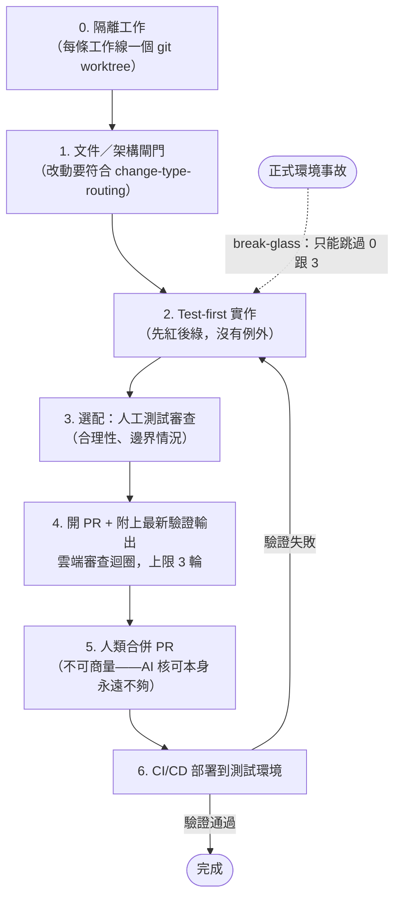
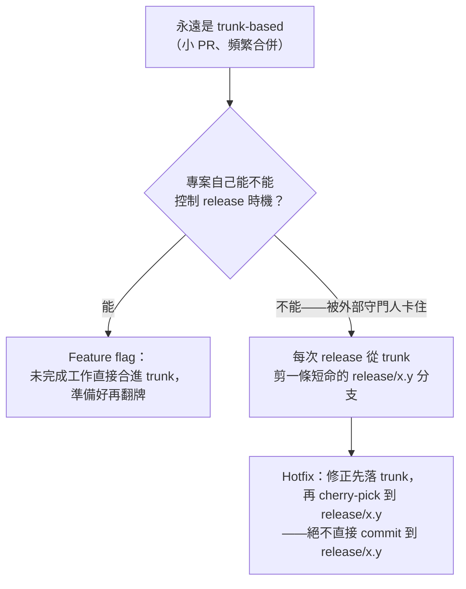

> 正體中文翻譯版，內容以 [`README.md`](./README.md)（英文，本專案 `CLAUDE.md` 訂定的標準版本）為準；兩份不同步時，以英文版為主。

# ai-workflow

這個團隊共用的執行階段工程紀律，給 Claude Code + superpowers 用——會自動同步進每個協作者的全域 Claude Code 配置，不只是一份要你手動複製進各個專案的骨架。

## 這個 repo 在解決什麼問題

個人的 `~/.claude/CLAUDE.md`（每個開發者、每台機器各一份）可以放一條**決策階段**規則——某個開發者遇到新需求、新功能、行為變更時，動手改代碼之前想怎麼處理。這條規則實際內容是什麼、靠哪些 skill 或流程,因人而異;這個 repo 沒有立場預設每個協作者都裝了同一套。那條規則解決的是「要不要做、怎麼做」——但它是個人的，沒辦法原封不動變成團隊共用規則，不然會蓋掉每個人各自的偏好。

真正缺的是**團隊層級的執行階段**：決定做了、真的要動手（不管是人還是 AI）改 repo 時，一個改動該套哪個 superpowers skill（TDD？systematic-debugging？frontend-design？）、該叫哪個專職 agent、審查要多深、誰有權合併——這件事需要對每個協作者、每個專案都**一致**，不然「團隊共用標準」這件事本身就沒意義。

`skills/change-type-routing/` 和 `skills/team-review-pipeline/` 這兩個 skill 就是把這件事寫成方法。`skills/change-type-routing/` 是一套方法——不是抄好的表——用來幫專案盤點出「哪種改動該用哪個機制（skill/agent/check）」。`skills/team-review-pipeline/` 管的是同一個執行階段的另一個軸：不是「哪個機制處理這個改動」，而是在 AI 主導大部分實作的團隊裡，「審查要多深、誰有權合併」。它組合既有的 superpowers skill，不另外發明機制：superpowers:test-driven-development 和 superpowers:verification-before-completion 決定「測試通過」算不算數；superpowers:using-git-worktrees 隔離併發中的工作；superpowers:writing-plans／executing-plans 把大改動拆成一個 task 一個 PR；superpowers:finishing-a-development-branch 負責合併後的清理。它的 review-depth 例外清單、多模型審查觸發條件、3 輪 review-loop 上限，都應該落地成專案自己 change-type-routing 表裡的橫切規則。

**目前進度**——review-depth 例外清單涵蓋 authN/authZ、金流、資料遷移、密鑰／基礎設施設定、未鎖定版本的新依賴，以及（自我指涉地）改動專案自己的 skill 檔案或 `CLAUDE.md`；針對正式環境事故有一條 break-glass 路徑，但永遠不能跳過例外清單審查與人類合併這道閘，只能跳過隔離跟可選的人工測試審查。`skills/team-review-pipeline/pressure-scenarios.md` 現在有 7 個情境，全部都各自拿 fresh subagent 實際跑過一次，通過。

## Team review pipeline 一覽

`skills/team-review-pipeline/SKILL.md` 才是原始依據，這份摘要跟它有出入時以它為準——這一節純粹是為了方便快速掌握流程跟規則、適合直接拿去做簡報。

### 開發流程



Break-glass 永遠不能跳過例外清單審查或第 5 步的人類合併閘——只能跳過隔離跟可選的測試審查，而且只限真的在發生事故時，事後還要在固定時限內補一份 postmortem PR。

### 各步驟核心內容

| 步驟 | 要求什麼 |
|---|---|
| 0. 隔離 | 每條工作線各自獨立的工作區（worktree），避免併發的人或 agent 在未提交狀態上互撞 |
| 1. 文件／架構閘門 | 動手寫程式碼之前，先確認改動符合專案的 `change-type-routing` 規則 |
| 2. Test-first 實作 | 先寫出一個會失敗（紅）的測試並實際觀察到它失敗，才開始實作；「測試通過」只有在這個 session 裡真的跑過驗證才算數 |
| 3. 選配：人工測試審查 | 人類檢查測試的合理性／完整性／邊界情況——這一步是否要做由專案自己決定，跟下面的例外清單審查不同，那個不能跳過 |
| 4. 開 PR | 附上最新的驗證輸出；跑自動化雲端審查迴圈，上限 3 輪，超過就升級給人類處理 |
| 5. 人類合併 | 整條 pipeline 唯一不可商量的規則——再多的 AI 審查核可都不能取代它 |
| 6. CI/CD 部署與驗證 | 部署到測試環境；驗證失敗會導回第 2 步，不會變成沒人管的死路 |

### 審查深度：預設 vs 例外清單

預設：只審查測試，不審查實作——但前提是測試要先寫（test-first），否則等同沒有審查。不管測試套件看起來多有信心，以下類別一律要求完整程式碼審查，外加透過 MCP 找第二個獨立模型審查：

- 認證／授權
- 金流或任何碰錢的東西
- 資料遷移
- 密鑰、憑證、基礎設施設定
- 改動專案自己的 skill 檔案、`CLAUDE.md` 或 `AGENTS.md`
- 任何還沒鎖定在 lockfile 裡的新／更新依賴

### Release 分支模型



每次 release 都要留下可追溯的標記（git tag、版本檔案、CHANGELOG 條目——形式由專案自訂），讓 release 分支的起始 commit、以及後續每次補丁都能追溯回去。

### CLAUDE.md 三層分法

- **Home 層**（組織／團隊層級）：透過這個 repo 自己的 `SessionStart` hook 機制自動同步（見下方說明）。
- **Repo 層**（專案層級）：專案自己的 `change-type-routing` 表——必須把 review-depth 例外清單、多模型審查觸發條件、review-loop 上限，以及專案選定的 release 分支模型，都寫成橫切規則的列。
- **Folder／package 層**（範圍限定、選用）：針對某個敏感子目錄（例如金流、認證模組）額外收緊的編輯邊界——是對上面例外清單的補充，不是替代。

## 同步機制怎麼運作

每位協作者跑這一次：

```
bash scripts/install.sh
```

這個一次性步驟會：備份 `~/.claude/settings.json`、把它的 `SessionStart` hook 指向 `scripts/sync.sh`、在協作者個人的 `~/.claude/CLAUDE.md` 加一行 `@<這個repo的路徑>/CLAUDE.md`（那份檔案裡其他內容完全不動）。從此之後，**每次 session 啟動**都會重跑 `scripts/sync.sh`，它會：

1. `git pull` 這個 repo。
2. 把 `skills/*`、`agents/*` 底下每個子目錄 symlink 進協作者全域的 `~/.claude/skills/`、`~/.claude/agents/`——如果該路徑已經有東西、而且不是這個 repo 建的 symlink，就跳過並警告，絕不覆蓋。
3. 對照 `scripts/third-party-plugins.json`（見下）核對第三方 plugin——缺的就裝，版本對不上就警告，絕不強制改版本。

這讓已經裝好的協作者能自我修復：repo 加了新 skill，大家下次開 session 就會自動拿到，不用手動重新同步。唯一沒辦法解決的，是全新協作者的第一次安裝——沒人能強制他跑 `scripts/install.sh`，因為在他跑之前什麼機制都還沒生效；這是一個文件化的 onboarding 步驟，不是機制。

**還留在專案層級、沒有全域化的部分**：`change-type-routing` 產出的**那張表**——某個專案針對自己目錄結構產出的實際路由表——還是留在那個專案自己的 `CLAUDE.md` 裡，因為那份內容本來就是專案專屬的。全域化的只有「產出那張表的方法（skill 本身）」。

**信任模型，講清楚**：`scripts/sync.sh`、`scripts/install.sh` 是會在每個協作者機器上無人看管自動執行的程式碼，而且透過 `git pull` 自我更新。誰能合併 `scripts/` 的改動，誰就能在每個協作者的機器上、下次 session 執行任意程式碼。這正是為什麼這個 repo 自己的 `CLAUDE.md` 把 `scripts/*` 的變更風險列得比一般 skill 內容更高——見它的橫切規則。

## 保持第三方 plugin 版本一致

`scripts/third-party-plugins.json` 釘住這個團隊談好的每個外部 plugin（superpowers、mattpocock-skills 等）的確切版本。`scripts/sync.sh` 每次 session 都會檢查：完全沒裝就自動裝；裝了但版本不對就警告（落後或超前都會報），不強制改版本——因為 `claude plugin` 這支 CLI 沒有能強制裝回指定版本的參數。要改動釘住的版本，是對這份檔案的一次刻意、需要審查的編輯，不是例行更新——審查標準見 `CLAUDE.md` 的分類表。

## 給這個團隊以外的專案或人

如果你不在這個團隊的同步設定裡——單純想評估這個 repo，或想改給別的團隊用——底層的 skill 手動複製一樣能用：把 `skills/change-type-routing/SKILL.md`（連同 `pressure-scenarios.md`）複製進某個專案的 `.claude/skills/change-type-routing/`，在那裡叫這個 skill，跟著它的盤點步驟產出那個專案自己的路由表（參考 `examples/spelldungeon.md` 的實例）。這樣複製出去的檔案不會自動跟這個 repo 同步，本來就預期會分岔成那個專案自己的具體版本。

## 這個 repo 自己的規範

這個 repo 對自己套用了同一套方法：根目錄的 `CLAUDE.md` 就是這個 repo 自己的 change-type-routing 表（skill 內容、agent 定義、pressure-scenario 檔案、worked examples、同步／安裝腳本、頂層文件），外加橫切規則把治理檔案跟同步腳本的改動列為這裡風險最高的兩類——腳本又比治理檔案更高，因為腳本會無人看管地執行，文字只會被讀。下面是摘要——跟 `CLAUDE.md` 有出入時以它為準。

**各類改動、合併前各自要求什麼：**

| 改動類型 | 檔案 | 要求什麼 |
|---|---|---|
| Skill 內容 | `skills/*/SKILL.md` | Frontmatter 的 `description` 要維持「Use when...」這種只講觸發時機的寫法——絕不能拿來總結 skill 的工作流程。任何內容變更合併前都要拿那個 skill 自己的 `pressure-scenarios.md` 重新驗證過，並留下 transcript 證據。 |
| Agent 定義 | `agents/*` | 標準跟 skill 內容一樣——合併前要完整讀過，因為一旦同步出去，這些會變成每個協作者能叫用的 subagent 類型。 |
| Pressure-scenario 檔案 | `skills/*/pressure-scenarios.md` | 新增或修改情境，PR 裡至少要附一次真的拿 subagent 跑過的 pass/fail 證據——寫好但沒跑過的情境只是草稿，不算驗證過。 |
| Worked examples | `examples/*.md` | 必須對應一個真實套用過的案例。如果目前還沒有專案真的用過這個方法，就要在檔案裡明講，不能生一個看起來合理但是編出來的案例。 |
| 同步／安裝腳本 | `scripts/*.sh`、`scripts/*.py` | 這個 repo 風險最高的一類——見下面的橫切規則。 |
| 第三方 plugin 釘選版本 | `scripts/third-party-plugins.json` | 改版本號是一次刻意、需要審查的決定（上游改了什麼、為什麼現在升級是安全的）——不是例行的依賴更新。 |
| 頂層文件 | `README.md`、`README.zh-TW.md` | 只要新增、改名或移除 skill、agent 或腳本，就要更新，並確認 skill 清單跟交叉引用都還對得上。`README.zh-TW.md` 可以短暫落後，但不該永久漂移；兩份不同步時以 `README.md` 為準。 |

**橫切規則，優先於上面表格的每一列：**

1. 任何動到 `SKILL.md` 或根目錄 `CLAUDE.md` 的改動都是最高風險等級，沒有例外——這些檔案一旦被同步或複製出去，就會變成其他專案、每個協作者的治理規則，一個不起眼的措辭問題（一個模糊的指示、被漏掉的例外）會悄悄擴散出去，而且沒有任何測試套件能抓到。不要因為「只是改個措辭」就跳過完整讀 diff。
2. 動到 `scripts/*.sh` 或 `scripts/*.py` 的改動,風險等級**比上面那條還高**。一個寫壞的 SKILL.md 頂多誤導讀文字的 AI；一個寫壞的腳本會在每個協作者機器上、每次 session 啟動時，用他們本地權限**無人看管地執行**。這個交易（腳本透過 `git pull` 自我更新，而不用每個協作者每次邏輯變動都手動重跑 `scripts/install.sh`）只有在這一類真的每次都被作者以外的人逐行讀過才成立。

**PR 顆粒度：** 一個 skill、一個 agent，或一個修復，各自一個 PR。這個 repo 存在的意義就是要能被拆開來 diff、被獨立同步或複製，把不相關的改動綁在同一個 PR 裡，只會讓審查跟之後的回退都更難。

**語言：** skill、agent、文件內容（包含腳本註解）都用英文寫；`README.zh-TW.md` 是唯一刻意保留的翻譯例外，不該永久落後 `README.md` 太多。這跟 session 本身用什麼語言討論這個 repo 無關。
